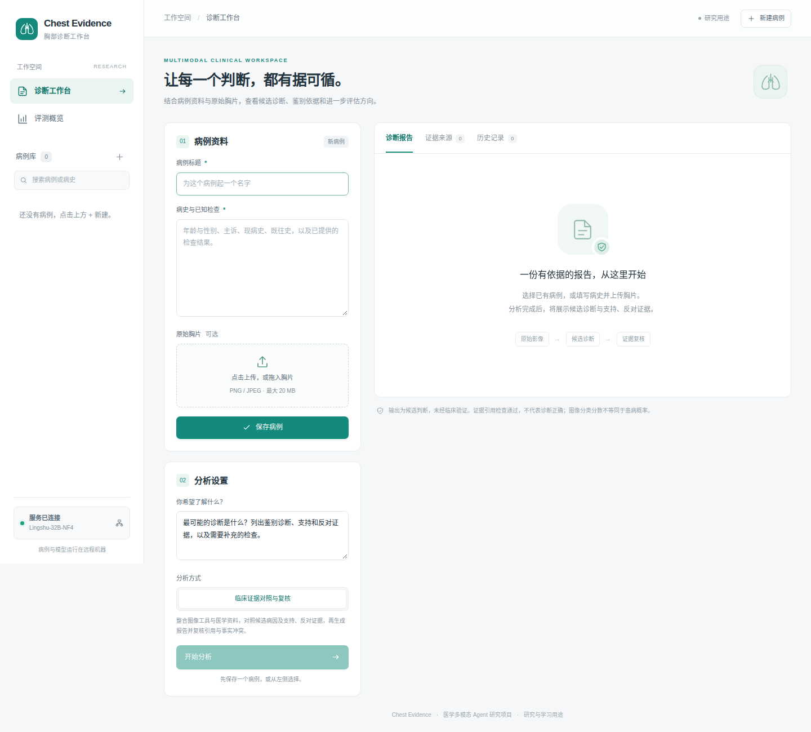

# Chest Evidence Agent

结合病史和胸片生成候选诊断报告的多模型 Agent 系统。LangGraph 协调独立影像分析、临床诊断、证据审查和报告修订，保留各 Agent 的意见及处理记录。



## 功能

- 上传胸片和病史，生成候选诊断、鉴别诊断及检查建议。
- 调用胸片分类、解剖区域分割和专用观察模型，检索医学参考资料。
- 在生成报告前比较候选病因，生成后检查证据引用和事实冲突，最多修订一次。
- 补充病例资料后重新分析，查看历史报告和判断变化，下载完整记录。

| Agent | 模型 | 职责 |
| --- | --- | --- |
| 影像 | NV-Reason-CXR-3B，BF16 | 独立观察胸片，不接收临床结论 |
| 临床 | Lingshu-32B，NF4 | 结合病史、原图与工具证据形成候选诊断 |
| 审查 | Qwen3-VL-8B-Instruct，NF4 | 使用独立模型核对报告与原始证据 |
| 协调 | Lingshu-32B，NF4 | 根据有效质疑修订报告，保存未解决问题 |

三个模型在 RTX 5090 32 GB 上分阶段执行。主模型常驻，影像和审查模型共用一个辅助显存槽，切换前释放前一个模型。

## 运行

需要 Python 3.11，先安装与显卡匹配的 PyTorch 和 torchvision。

```bash
git clone https://github.com/popcatwhu/chest-evidence-agent.git
cd chest-evidence-agent
python3.11 -m venv .venv
source .venv/bin/activate
pip install -e '.[dev,quantized]'
```

准备模型和参考资料后启动：

```bash
bash scripts/start.sh
```

浏览器打开 `http://127.0.0.1:7860`。模型下载、32B 量化、API 配置和远程访问见 [安装说明](docs/SETUP.md)。权重和病例数据需要单独准备。

## 实现

```text
病史 / 胸片 → NV 影像 Agent → 工具与检索 → Lingshu 临床 Agent
          → Qwen 审查 Agent → Lingshu 协调修订 → 保存报告
```

LangGraph 管理流程，Pydantic 校验结构化输出。推理任务串行执行，SQLite 保存输入快照、报告和事件。前端使用 HTML、CSS 和 JavaScript；检索采用字符 TF-IDF。

```text
chest_agent/   后端、模型调用和诊断流程
static/        工作台
scripts/       数据准备、模型下载和评测
tests/        单元测试
evals/        评测汇总和运行环境
docs/         安装、设计和评测说明
```

[设计说明](docs/DESIGN.md)介绍工具证据、检索和复核的处理方式。

## 评测

20位未使用过的公开测试患者，结果如下：

| 指标 | 结果 |
| --- | --- |
| 报告中的选择题结论 | 15/20，75% |
| 完整报告生成 | 20/20 |
| 全部专业 Agent 完整参与 | 19/20 |
| 耗时中位数 | 63.94秒 |
| GPU峰值保留显存 | 28.14 GiB |
| 仍需复核的报告 | 16/20 |

1例影像 Agent 未完成，其失败记录和复核标记保留。95% Wilson 区间为53.13%–88.81%，样本较小；不同患者集合的得分不能直接证明相对其他流程有提升。

项目用于研究和演示，未经临床验证。模型意见和引用有效性不能证明医学正确。

[评测方法](docs/EVALUATION.md) · [结果](evals/summary.json) · [运行环境](evals/environment.json)

## 开发

```bash
pytest -q
ruff format --check chest_agent scripts tests
```

## 来源与许可

项目参考了 [MedRAX](https://github.com/bowang-lab/MedRAX) 的工具协作思路，使用 Lingshu 和 TorchXRayVision 等模型与工具。相关论文见 [参考资料](docs/REFERENCES.md)。

代码使用 [MIT](LICENSE) 许可；模型、数据和参考资料遵循各自条款，见 [第三方说明](THIRD_PARTY_NOTICES.md)。
