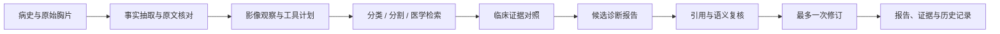

# Chest Evidence Agent

**本地医学多模态 Agent：从病史与胸片，到可追溯的候选诊断报告。**

基于 FastAPI、LangGraph 和本地视觉语言模型，提供中文工作台、图像工具、医学检索、证据检查、病例更新与可复查评测。项目面向 Agent 应用开发研究与工程演示，未经临床验证。


> 截图展示界面空状态，不包含真实患者资料、胸片或预设诊断。

## 能做什么

- 上传病史与胸片，生成最可能候选、鉴别诊断、支持和反对依据及进一步评估方向。
- 使用本地 Lingshu-32B NF4，支持显存内运行；也可选择7B模型或OpenAI兼容API。
- 调用胸片分类、肺/心脏区域分割及专用胸片观察模型。分类分数不是患病概率，分割不定位病灶。
- 检索带来源的医学资料；将病例原文、模型观察和参考资料分别保存。
- 核对关键病例线索，比较候选病因与证据冲突；检查引用、重复诊断及确认检查建议，最多一次修订。
- 补充资料后重新分析，保存每次输入快照、执行事件和历史报告。
- 提供原图放大、证据跳转、任务刷新恢复、记录下载与移动端布局。

## 流程与工程结构



| 部分 | 实现 |
| --- | --- |
| API与任务执行 | FastAPI、单工作线程串行GPU任务 |
| Agent状态流转 | LangGraph，有界修订 |
| 模型 | Transformers、bitsandbytes NF4、BF16计算 |
| 结构化输出 | LM Format Enforcer + Pydantic |
| 检索 | 小规模TF-IDF字符检索，保留URL和来源类型 |
| 数据持久化 | SQLite、输入快照、事件及原始模型输出 |
| 前端 | 原生HTML/CSS/JavaScript，同源API |

代码位于 `chest_agent/`，前端位于 `static/`，准备与评测工具位于 `scripts/`，测试位于 `tests/`。

## 真实评测结果

当前 Agent 使用完整病史、原始胸片和公开问题，执行临床证据对照、报告生成与复核。在按患者隔离的20例公开测试中：

| 指标 | 结果 |
| --- | --- |
| 报告中的选择题结论 | 15/20，75% |
| 完整报告生成 | 20/20 |
| 耗时中位数 | 58.25秒 |
| GPU峰值保留显存 | 21.62 GiB |
| 保留可用临床证据对照 | 12/20 |
| 标记仍需复核 | 18/20 |

75%衡量报告中的选择题结论，不代表临床诊断准确率；样本较小，公开数据预训练污染情况未知，尚未进行临床专家评分。原文线索匹配和引用检查也不能证明医学正确。临床对照未完成时仍保存有效报告，同时标记待复核。

6位已知开发患者中，具体诊断名称符合参考结局的为4/6，疾病大类为5/6；这些是开发验证，不能作为独立准确率。结核仍误判，张力性气胸仍只识别到大类。

实际汇总见 [full_report_quality_validation.json](full_report_quality_validation.json)，评测流程见 [docs/EVALUATION.md](docs/EVALUATION.md)。69项工程测试通过。

## 安装

建议Python3.11。先安装适合自己硬件的PyTorch/torchvision，再安装项目；无需依赖开发者的其他Python环境。

```bash
git clone https://github.com/popcatwhu/chest-evidence-agent.git
cd chest-evidence-agent
python3.11 -m venv .venv
source .venv/bin/activate
# 先按照PyTorch官方安装说明安装匹配GPU的版本
python -m pip install -e '.[dev,quantized]'
python -m pytest -q
```

本机测试环境版本记录在 [environment.json](environment.json)：PyTorch2.11、CUDA13运行时、Transformers4.57.6。RTX5090需要支持其架构的PyTorch构建。

### 本地模型

先用7B验证流程，或者准备32B的NF4版本。下载脚本固定官方版本，分块下载脚本对权重核对官方LFS SHA256，不执行远端模型代码。

```bash
# 7B，BF16
python scripts/download_model_ranges.py 7b
# 辅助观察模型
hf download IAMJB/chexpert-mimic-cxr-findings-baseline --local-dir ../models/CXR-Findings
# 可选：加载通用公开资料，参考图与元数据需要MedRAX仓库
git clone https://github.com/bowang-lab/MedRAX.git ../MedRAX
python scripts/prepare_data.py
python scripts/expand_knowledge.py
CHEST_MODEL_PATH="$PWD/../models/Lingshu-7B" bash scripts/start.sh
```

`prepare_data.py`中的教学演示由人工病史和独立样例胸片组成，仅验证流程，不用于准确率评估。扩展资料保留来源及摘要类型，不伪装成完整临床指南库。图像分类/分割检查点由TorchXRayVision按需下载。

32B转换需单独占用GPU，先停止推理服务：

```bash
python scripts/download_model_ranges.py 32b
python scripts/quantize_local_model.py \
  --source ../models/Lingshu-32B --output ../models/Lingshu-32B-NF4
bash scripts/start.sh
```

默认模型目录是 `../models/Lingshu-32B-NF4`。转换保留视觉模块与lm_head原精度，保存分词器与来源版本；模型权重不随仓库分发。大模型初次从机械盘加载可能耗时数分钟，暖运行与冷启动不能混用。

### API后端

也可以配置OpenAI兼容服务。真实Key只放本地环境变量，示例见 [.env.example](.env.example)。

```bash
cp .env.example .env
# 编辑.env，填写自己的提供商地址、模型名和Key
set -a
source .env
set +a
bash scripts/start.sh
```

API模式设置 `CHEST_BACKEND=api`、`CHEST_API_MODEL`、`OPENAI_BASE_URL` 和 `OPENAI_API_KEY`。本地没有专用观察权重时可设置 `CHEST_CXR_EXPERT=0`；工具失败不会被当成正常影像。

## 访问与开关

默认地址是 `http://127.0.0.1:7860`。服务运行在远端时，可用VSCode「端口」面板转发7860，使用面板给出的本地地址。局域网监听可配置：

```bash
CHEST_HOST=0.0.0.0 CHEST_PORT=7860 bash scripts/start.sh
```

页面与API使用相同地址，无需修改前端后端地址。

| 环境变量 | 默认值 | 含义 |
| --- | --- | --- |
| `CHEST_MODEL_PATH` | `../models/Lingshu-32B-NF4` | 本地模型路径 |
| `CHEST_HOST` / `CHEST_PORT` | `127.0.0.1` / `7860` | 监听地址和端口 |
| `CHEST_BACKEND` | `local` | local或api |
| `CHEST_CXR_EXPERT` | `1` | 启用专用观察工具 |
| `CHEST_CXR_READER` | `iamjb` | IAMJB观察模型；nvreason为可选实验模型 |
| `CHEST_RECHECK_IMAGE` | `1` | 诊断、复核、修订接收原图 |
| `CHEST_CONSTRAINED_JSON` | `1` | 本地JSON Schema解码约束 |
| `CHEST_MAX_INPUT_TOKENS` | `8192` | 当前输入上限 |

## 评测与复现

需要另行获取上游数据及模型，仓库只提供代码与实际汇总，不包含原始胸片、患者数据库或模型权重。准备脚本保留输入指纹和病例划分，参考字段不会送入推理请求。

```bash
# 准备公开基准候选池和小型开发数据
python scripts/prepare_benchmark.py --limit 5
# 需先准备MedRAX元数据，再冻结按患者隔离的样本
python scripts/prepare_independent_benchmark.py
# 对常驻服务评测Agent完整报告
python scripts/evaluate_http.py --modes verified --output data/independent/results.json
# 简洁答题实验单独执行，避免与完整报告混用
python scripts/benchmark_mcq.py --output data/minimal_mcq.json
```

新的实验应另存结果，不覆盖冻结历史。准备新的测试样本时使用 `--exclude-manifest`、`--seed`、`--output-dir`；在查看测试成绩前锁定候选策略。

主要接口：`/api/health`、`/api/cases`、`/api/cases/{id}/runs`、`/api/runs/{id}`，以及图像、补充资料和完整记录下载接口。

## 边界与来源

这是受MedRAX思路启发的独立应用扩展，不是MedAgent-Pro或MedRAX论文指标复现。引用匹配和结构有效不能证明医学正确；缺失确认检查、模型观察错误和病因误判仍可能发生。

代码采用MIT许可。依赖、数据和模型遵循上游条款，见 [THIRD_PARTY_NOTICES.md](THIRD_PARTY_NOTICES.md)。
